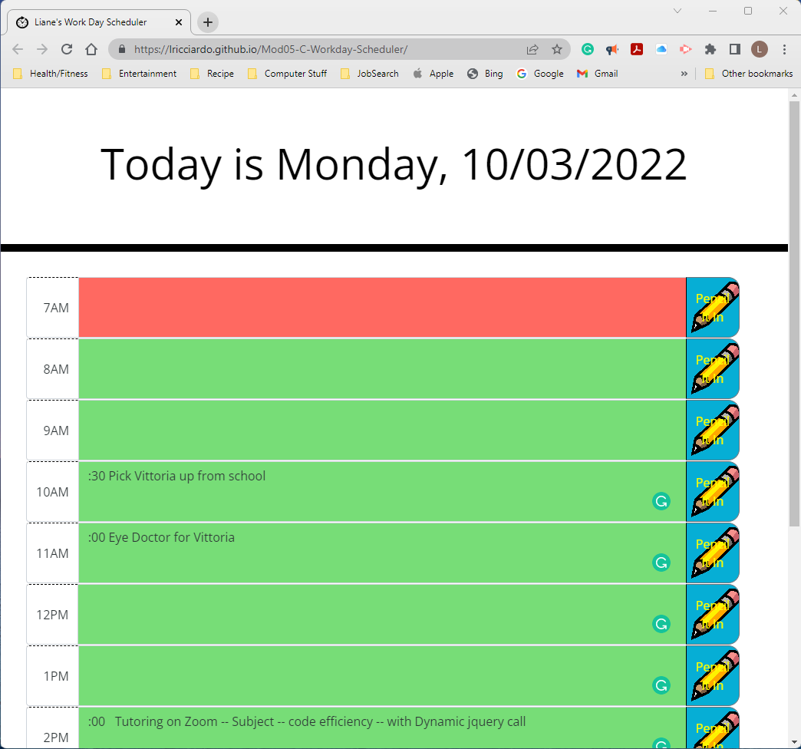

# Mod05-C-Workday-Scheduler
Workday Schedule

## Description

Create a planner to plan your daily schedule. Type in your activity then click on a save button. It will store your data in local storage for later.

## Installation

No installation needed. Just run the webpage: 
[Module 5 Challange Webpage](https://lricciardo.github.io/Mod05-C-Workday-Scheduler/) 

## Usage

Type your your appointment or todo on the hour it is to be done. click the mouse on the "Pencil It In" buttons to save it.

[click Here for Big Screenshot of WorkDay Schedule](./READMEimages/Mod05-C-Screenshot.png)

## Credits

Used starter code for project, Bootstrap, day.js, jquery, and fontAwesome.

I used the pencil image from (www.vecteezy.com) and made the background transparent.
I used a clockface image from the internet but forgot where (sorry but it was free).

## License

Please refer to GitHub for license information.